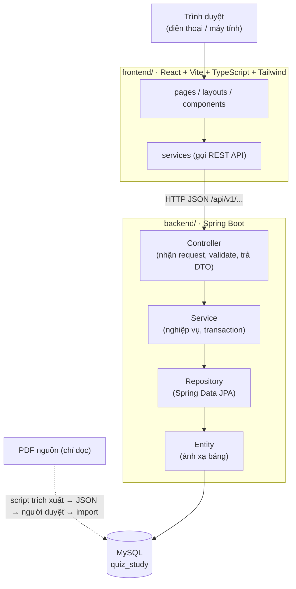
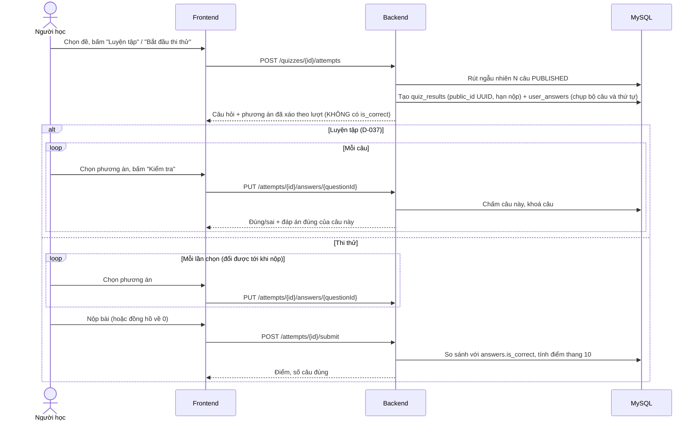

# Kiến trúc hệ thống (đề xuất)

> Trạng thái: đã duyệt ở Phase 0. Phase 1 đã có khung frontend/backend và endpoint `GET /api/v1/health`.

## 1. Tổng quan

Quiz Study là web học tập và luyện thi trắc nghiệm **nhiều môn**. Python và Giáo dục quốc phòng là hai môn đầu tiên. Mọi môn dùng chung một bộ bảng, API và giao diện. Thêm môn mới là **thêm dữ liệu**, không phải viết thêm code.



- **Frontend và backend tách riêng**: hai project, hai lệnh chạy, giao tiếp qua REST/JSON.
- Backend là nơi **duy nhất** truy cập database và **chấm điểm**.

## 2. Nguyên tắc kiến trúc

| Nguyên tắc | Cụ thể |
|---|---|
| Không hard-code môn học | Không có bảng, route, component hay enum riêng cho từng môn. URL dùng `slug` của môn (`/subjects/python`). Không viết kiểu `if (subject == "python")` |
| Controller mỏng | Controller chỉ nhận request, validate, gọi Service, trả DTO. Nghiệp vụ nằm ở Service |
| Không lộ Entity | API trả về DTO. Entity JPA không đi ra ngoài tầng Service |
| Đáp án an toàn | API lấy câu hỏi để làm bài **không trả `is_correct`**. Server chấm khi nộp bài |
| Tối thiểu dependency | Chỉ dùng stack đã chốt; mọi thư viện mới phải được duyệt ([decisions.md](decisions.md)) |
| Mobile-first | Thiết kế cho màn hình điện thoại trước, mở rộng dần lên tablet/desktop |

## 3. Frontend (`frontend/`)

| Hạng mục | Lựa chọn |
|---|---|
| Build tool | Vite (tạo project bằng template `react-ts` ở Phase 1) |
| UI | React, TypeScript `strict` |
| Style | Tailwind CSS v4 qua plugin `@tailwindcss/vite` |
| Routing | React Router, dùng ở chế độ SPA (library mode), **không** dùng "framework mode" (SSR) |
| Gọi API | `fetch` có sẵn của trình duyệt, bọc trong `src/services/` (đề xuất không thêm axios) |
| State | `useState` / `useReducer` / Context. **Không** dùng Redux |
| Test | Vitest + React Testing Library (unit/component); Playwright (E2E, `npm run test:e2e`, Chrome đã cài, khung Pixel 7 + máy tính, D-041) |
| PWA | `vite-plugin-pwa` (D-040): manifest, icon trong `public/icons/`, service worker lưu sẵn file giao diện để mở được khi mất mạng. **Không** lưu đệm `/api` (không làm bài offline). Có bản mới thì hỏi người dùng (`UpdatePrompt`), không tự tải lại giữa lúc làm bài |
| Điện thoại | Mobile-first; khi thi thử thanh đồng hồ dính đầu màn hình; chuyển câu bằng nút / lưới số câu (không dùng vuốt, D-044); máy tính có phím tắt Enter / ← → (`useHotkey`) |
| Đoạn code | `CodeBlock` tô màu cú pháp kiểu VS Code Dark+ bằng `codeHighlight.ts` (tự viết, không thêm thư viện, D-047); giữ nguyên thụt lề, cuộn ngang trên điện thoại |
| Chế độ học | Trang `StudyPage` (D-044): cả bài trên một trang, đáp án đúng tô xanh, không chọn / không chấm; API riêng `/subjects/{slug}/chapters/{id}/study` |
| Lint | Oxlint, mặc định của template `create-vite` (D-023) |
| Thiết kế | Hướng "bàn học yên tĩnh" (D-028). Token màu trong `src/index.css`, component dùng class ngữ nghĩa (`bg-primary`, `text-muted`…) |
| Tải dữ liệu | Hook `useAsync(load)` trả `loading` / `success` / `error` + `reload`; component `AsyncContent` hiển thị đúng trạng thái và giữ focus khi bấm "Thử lại". Chỉ thông điệp của `ApiError` (tiếng Việt) được hiện cho người dùng |

Cấu trúc thư mục (✔ = đã có từ Phase 3):

```
frontend/src/
├── components/   # UI tái sử dụng. ✔ Button, ButtonLink, Card, AsyncContent, LoadingState, ErrorState, EmptyState, LetterBadge
│                 #   ✔ Làm bài (Phase 5): QuestionView, CodeBlock, QuestionNavigator, CountdownTimer, SubmitConfirm, AttemptOutcome
│                 #   ✔ Phase 6: RecentAttemptList, ShortcutHint · PWA (Phase 10): OfflineBanner, UpdatePrompt, PwaUpdatePrompt
├── pages/        # Mỗi route một trang. ✔ HomePage, SubjectPage, StudyPage, AttemptPage, NotFoundPage, RouteErrorPage
├── layouts/      # ✔ MainLayout (header, điều hướng, footer) + navigation.ts (danh sách mục điều hướng)
├── services/     # Chỗ duy nhất gọi fetch. ✔ apiClient.ts (apiGet, apiPost, apiPut), subjectService.ts, quizService.ts, studyService.ts
├── hooks/        # ✔ useAsync, useQuizAttempt (trạng thái làm bài), useStartAttempt, useFocusOnChange
│                 #   ✔ Phase 6/10: useHotkey (phím tắt), useOnlineStatus (mất mạng)
├── types/        # Kiểu khớp DTO backend. ✔ api.ts (ProblemDetail, InvalidField), subject.ts, quiz.ts, study.ts
├── routes.tsx    # ✔ pageRoutes (danh sách trang) + createAppRoutes() (layout + trang lỗi), dùng chung cho App và test
├── App.tsx       # Tạo router từ routes.tsx
└── main.tsx      # Điểm vào
```

Xử lý lỗi gọi API: `apiClient` luôn ném `ApiError` có `message` tiếng Việt hiển thị được: lấy `detail` của Problem Details; mất mạng → `status = 0`; body không phải Problem Details (ví dụ proxy trả 502) hoặc response thành công nhưng không phải JSON → thông điệp chung. Lỗi 400 kèm `errors` (danh sách trường lỗi).

Các trang dự kiến (chốt dần theo phase):

| Route | Trang | Phase |
|---|---|---|
| `/` | Trang chủ, danh sách môn | 3–4 |
| `/subjects/:slug` | ✔ Chi tiết môn: các bài, nút luyện tập từng bài, thẻ thi thử cả môn | 4–5 |
| `/attempts/:attemptId` | ✔ Làm bài (luyện tập / thi thử); `attemptId` là UUID của lượt làm | 5 |
| (trong trang làm bài) | ✔ Xem lại từng câu sau khi nộp (đã chọn gì, đáp án đúng, câu bỏ trống) | 6 |
| `/` (mục "Lượt làm gần đây") | ✔ Tối đa 10 lượt làm gần nhất trên trình duyệt này (`localStorage`, không cần đăng nhập) | 6 |
| `/history` | Lịch sử làm bài | 6–7 |
| `/login`, `/register` | Đăng nhập / đăng ký | 7 |
| `/admin/...` | Quản trị môn, chương, câu hỏi, duyệt câu | 8 |
| `/ranking` | Xếp hạng, thống kê | 9 |

Khi phát triển, Vite chạy ở cổng 5173 và **proxy** `/api` sang backend ở cổng 8080. Trình duyệt thấy cùng một origin nên không phải cấu hình CORS ở môi trường dev.

## 4. Backend (`backend/`)

| Hạng mục | Lựa chọn |
|---|---|
| Ngôn ngữ | Java 25 (LTS, D-024) |
| Framework | Spring Boot 4.1.x (bản ổn định hiện tại trên Spring Initializr), build bằng **Maven** (đã cài 3.9.16; dự án dùng Maven Wrapper `mvnw`) |
| Module | Spring Web (REST), Spring Data JPA, Bean Validation, MySQL Connector/J; Spring Security thêm ở Phase 7 (đề xuất) |
| Test | JUnit 5, Spring Boot Test, MockMvc, Mockito |

Cấu trúc package dự kiến (package gốc tạm đặt `com.quizstudy`, chờ bạn chốt):

```
backend/src/main/java/com/quizstudy/
├── QuizStudyApplication.java
├── config/        # Cấu hình Spring: ClockConfig, QuizDefaultsProperties, SpaFallbackConfig (bản deploy trả index.html cho đường dẫn của SPA)
├── controller/    # @RestController: SubjectController, QuizController, ...
├── service/       # Nghiệp vụ: SubjectService, QuizService (rút câu, chấm điểm), ...
├── repository/    # Spring Data JPA: SubjectRepository, QuestionRepository, ...
├── entity/        # @Entity: Subject, Chapter, Question, Answer, Quiz, QuizResult, UserAnswer, User
├── dto/           # Request/Response record: SubjectResponse, SubmitAnswerRequest, ...
├── mapper/        # Chuyển Entity <-> DTO (viết tay, không thêm MapStruct)
├── exception/     # Exception nghiệp vụ + @RestControllerAdvice xử lý lỗi tập trung
└── command/       # Lệnh chạy từ dòng lệnh, không qua HTTP (Phase 4: ImportCommandRunner, --import=<file>)
```

Trách nhiệm từng tầng:

| Tầng | Được làm | Không được làm |
|---|---|---|
| Controller | Map URL, `@Valid` request, gọi Service, trả `ResponseEntity<DTO>` | Chứa nghiệp vụ, gọi Repository trực tiếp, trả Entity |
| Service | Nghiệp vụ, `@Transactional`, kiểm tra quy tắc (ví dụ câu `PUBLISHED` phải có đúng 1 đáp án đúng) | Biết về HTTP (request/response, status code) |
| Repository | Truy vấn dữ liệu (method query, `@Query`) | Chứa nghiệp vụ |
| Entity | Ánh xạ bảng, quan hệ JPA | Được serialize trực tiếp ra JSON |

Cấu hình: `application.yml` + profile `dev` / `test`. Thông tin nhạy cảm (mật khẩu DB…) lấy từ **biến môi trường**, không ghi vào file commit.

Deploy (`Dockerfile` ở thư mục gốc, dùng cho Railway): build frontend, chép `dist/` vào `backend/src/main/resources/static/`, đóng gói một file jar phục vụ cả API lẫn giao diện trên cùng cổng (`PORT`). `SpaFallbackConfig` trả `index.html` cho đường dẫn của app (ví dụ mở thẳng `/subjects/python`); `/api/...` sai đường dẫn và file tĩnh thiếu vẫn 404. Database trên server cần import môn riêng (dữ liệu câu hỏi không nằm trong Git, D-030).

## 5. Quy ước REST API

- Tiền tố: `/api/v1/…`. Tên tài nguyên là danh từ số nhiều: `/subjects`, `/chapters`, `/quizzes`.
- Danh sách lớn dùng phân trang `?page=0&size=20`.
- Lỗi trả theo chuẩn **Problem Details (RFC 9457)**, `Content-Type: application/problem+json`. Xử lý tập trung ở `exception/GlobalExceptionHandler`. `detail` bằng tiếng Việt, frontend hiển thị trực tiếp:
  `{ "title": "Not Found", "status": 404, "detail": "Không tìm thấy môn học 'java'", "instance": "/api/v1/subjects/java" }`
- Lỗi chuẩn của Spring MVC (JSON hỏng, sai kiểu tham số, thiếu tham số, sai method, URL không tồn tại…) cũng trả `detail` tiếng Việt, lấy từ `backend/src/main/resources/messages.properties`.
- Validation lỗi (body `@Valid` hoặc tham số `@RequestParam` / `@PathVariable`) trả `400`, kèm danh sách field lỗi trong `errors` (`field` là null nếu lỗi thuộc cả request):
  `{ "status": 400, "detail": "Dữ liệu gửi lên không hợp lệ.", "errors": [ { "field": "name", "message": "Tên không được để trống" } ] }`
- Lỗi không lường trước trả `500` với thông báo chung; chi tiết chỉ ghi vào log của server, không gửi cho client.
- Service báo "không tìm thấy" bằng `ResourceNotFoundException` (→ 404), không tự tạo response HTTP.

API dự kiến (chốt chi tiết ở từng phase):

| Method | Endpoint | Mục đích | Phase |
|---|---|---|---|
| GET | `/api/v1/health` | Kiểm tra backend chạy | 1 |
| GET | `/api/v1/subjects` | ✔ Danh sách môn đã publish, kèm số bài và số câu `PUBLISHED` | 4 |
| GET | `/api/v1/subjects/{slug}` | ✔ Chi tiết môn + các bài (số câu mỗi bài). Không có hoặc chưa publish → 404 | 4 |
| GET | `/api/v1/subjects/{slug}/quizzes` | ✔ Các đề của môn: đề cả môn trước, rồi theo thứ tự bài; số câu thực tế mỗi lượt | 5 |
| GET | `/api/v1/subjects/{slug}/chapters/{chapterId}/study` | ✔ Chế độ học (D-044): mọi câu `PUBLISHED` của bài kèm đáp án đúng và giải thích. Bài không thuộc môn → 404 | sau 10 |
| POST | `/api/v1/quizzes/{quizId}/attempts` | ✔ Bắt đầu lượt làm → 201 + `Location`; câu hỏi và phương án **không kèm đáp án đúng** | 5 |
| GET | `/api/v1/attempts/{attemptId}` | ✔ Mở lại lượt làm (tải lại trang); thi thử quá hạn thì được chấm. Thi thử đã kết thúc: kèm đáp án đúng của mọi câu để xem lại (D-038) | 5–6 |
| PUT | `/api/v1/attempts/{attemptId}/answers/{questionId}` | ✔ Lưu lựa chọn. Luyện tập: trả đúng/sai + đáp án đúng **của câu đó**, khoá câu | 5 |
| POST | `/api/v1/attempts/{attemptId}/submit` | ✔ Nộp bài thi thử; server chấm thang 10 (luyện tập → 409) | 5 |

Lỗi nghiệp vụ của làm bài: `409` (`BusinessRuleException`, ví dụ bài đã nộp, hết giờ, đổi đáp án luyện tập), `400` (`InvalidRequestException`, phương án không thuộc câu hỏi), `404` (lượt làm / đề không có).
| GET | `/api/v1/me/attempts` | Lịch sử của người dùng | 6–7 |
| POST | `/api/v1/auth/register`, `/login`, `/logout` | Xác thực | 7 |
| … | `/api/v1/admin/...` | Quản trị nội dung | 8 |

## 6. Luồng làm bài



- Mọi thao tác ghi khoá dòng `quiz_results` của lượt làm (`SELECT … FOR UPDATE`), nên lưu và nộp cùng lúc không chen nhau.
- Thi thử quá hạn (cộng 10 giây cho trễ mạng) được chấm ở yêu cầu đầu tiên tới sau hạn, trạng thái `EXPIRED`.
- Thứ tự phương án xáo theo (lượt làm, câu) nên tải lại trang vẫn giữ nguyên, không phải lưu thứ tự; câu `shuffle_answers = FALSE` giữ thứ tự gốc.

## 7. Bảo mật (Phase 7, tóm tắt)

- Mật khẩu hash bằng BCrypt; không log mật khẩu hay token.
- Phân quyền `USER` / `ADMIN`; mọi `/api/v1/admin/**` yêu cầu `ADMIN`.
- Cơ chế đăng nhập (session cookie hay JWT) **chưa chốt**, xem [decisions.md](decisions.md).
- Secrets chỉ nằm trong biến môi trường / file `.env` (đã có trong `.gitignore`).

## 8. Nhập dữ liệu câu hỏi

```
PDF nguồn (chỉ đọc)
   └─► scripts/extract_<môn>.py (Python + PyMuPDF, D-029): trích xuất + tự kiểm tra
         └─► database/seed/<slug>/generated/import.json + review.md (không commit, D-030)
               └─► CHỦ DỰ ÁN DUYỆT review.md (quyết định ghi vào database/seed/<slug>/subject.json)
                     └─► scripts/import-subject.ps1 -Slug <slug> [-Replace]
                           └─► backend (ImportCommandRunner → SubjectImportService): kiểm tra toàn bộ, ghi một transaction
```

- GDQP: tự động theo chữ đỏ (Phase 4A). Python: bán tự động, Claude xác định đáp án (Phase 4B, D-020, D-026).
- Định dạng JSON và quy tắc kiểm tra: [database-design.md](database-design.md#7-dữ-liệu-trung-gian-khi-import).
- Cách chạy: [scripts/README.md](../scripts/README.md).

## 9. Thêm một môn mới

1. Chuẩn bị file JSON theo định dạng chung (hoặc nhập qua trang Admin từ Phase 8).
2. Import. Hệ thống tạo `subjects`, `chapters`, `questions`, `answers` và các đề luyện tập mặc định.
3. Bật `is_published` cho môn.

Không sửa schema, không sửa code backend/frontend.

## 10. Môi trường phát triển

| Thành phần | Yêu cầu | Máy gốc (Windows 10) | Máy 2 (Windows 11) |
|---|---|---|---|
| Node.js / npm | 22.12+, 24.x hoặc 26+ (theo Vitest 5) | v26.7.0 / 12.0.2 | v24.20.0 / 11.19.0 |
| Java | JDK 25 (D-024) | OpenJDK 21.0.12 (Microsoft) → **cần cài JDK 25** | `JAVA_HOME` = `C:\Program Files\Java\jdk-25.0.4` (Oracle JDK 25.0.4) |
| Maven | Dùng `mvnw` của dự án (Maven 3.9.16) | 3.9.16 | 3.9.16 |
| MySQL | 8.0+ (cổng 3306) | 8.0.46, service `MySQL80` | 8.0.46, service `MySQL80` |
| Git | | 2.55.0 | 2.55.0 |
| Docker | Không bắt buộc | **Chưa cài** | 29.8.0 |
| Python | Chỉ cần cho công cụ trích xuất (Phase 4) | | 3.14.5 (lệnh `py`; lệnh `python` chưa dùng được) |
| GitHub CLI (`gh`) | Không bắt buộc | **Chưa cài** | **Chưa cài** |

Cả hai máy: `mysql.exe` **chưa có trong PATH**; `scripts/setup-database.ps1` tự tìm trong `C:\Program Files\MySQL\`.

| Dịch vụ | Cổng |
|---|---|
| Frontend (Vite dev server) | 5173 |
| Backend (Spring Boot) | 8080 |
| MySQL local | 3306 |
| MySQL Docker (tuỳ chọn) | 3307 |
