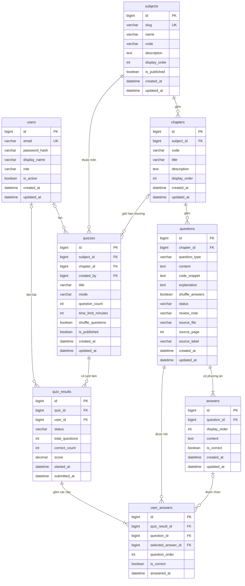

# Thiết kế cơ sở dữ liệu

> Trạng thái: đã duyệt. **Phase 2 đã tạo 4 bảng nội dung** (`subjects`, `chapters`, `questions`, `answers`) bằng migration `backend/src/main/resources/db/migration/V1__create_content_tables.sql`. Các bảng làm bài (`quizzes`, `quiz_results`, `user_answers`) tạo ở Phase 5, `users` ở Phase 7.
> DBMS: MySQL 8.0 (máy hiện có MySQL Server 8.0.46).

## 1. Mục tiêu thiết kế

1. **Nhiều môn, dùng chung một bộ bảng.** Môn học là *dữ liệu* (một dòng trong `subjects`), không phải cấu trúc. Không có bảng kiểu `python_questions` hay `gdqp_questions`. Thêm môn mới (Java, Toán, Vật lý…) chỉ là thêm dữ liệu, không sửa schema hay code.
2. **Phân cấp nội dung:** `Subject → Chapter → Question → Answer`.
3. **Không mất dấu nguồn:** mỗi câu hỏi biết nó đến từ file nào, trang nào, số câu gốc nào.
4. **Không bịa đáp án:** câu chưa có hoặc chưa chắc đáp án vẫn lưu được (trạng thái `DRAFT` / `NEEDS_REVIEW`) nhưng không được đưa vào bài thi.
5. **Chấm điểm ở server:** đáp án đúng không gửi xuống trình duyệt trước khi nộp bài.
6. **Đơn giản trước, mở rộng sau:** chỉ tạo những gì các phase đầu cần; phần mở rộng được ghi ở mục 8.

## 2. Quy ước chung

| Quy ước | Giá trị |
|---|---|
| Engine / bộ ký tự | InnoDB, `utf8mb4`, collation `utf8mb4_0900_ai_ci` (hỗ trợ đầy đủ tiếng Việt) |
| Tên bảng / cột | `snake_case`, tên bảng số nhiều (`subjects`, `quiz_results`) |
| Khoá chính | `id BIGINT AUTO_INCREMENT` |
| Khoá ngoại | `<bảng_số_ít>_id`, ví dụ `subject_id` |
| Thời gian | `DATETIME(6)`, lưu theo **UTC** (D-027); mọi bảng nội dung có `created_at`, `updated_at`. Hibernate tự điền; `DEFAULT CURRENT_TIMESTAMP(6)` trong bảng chỉ để dự phòng khi thêm dữ liệu bằng SQL tay |
| Giá trị liệt kê | Lưu `VARCHAR` (JPA `@Enumerated(EnumType.STRING)`), không dùng kiểu `ENUM` của MySQL, để thêm giá trị mới không phải ALTER bảng |
| Xoá dữ liệu | Câu hỏi đã từng được dùng trong bài làm thì **không xoá cứng**, chỉ chuyển sang `ARCHIVED` để lịch sử làm bài vẫn đúng |

## 3. Sơ đồ ERD



## 4. Mô tả từng bảng

### 4.1 `users`: người dùng
Dùng từ Phase 7 (Authentication).

| Cột | Kiểu | Ràng buộc | Ghi chú |
|---|---|---|---|
| `id` | BIGINT | **PK**, AUTO_INCREMENT | |
| `email` | VARCHAR(255) | NOT NULL, **UNIQUE** | Tên đăng nhập |
| `password_hash` | VARCHAR(255) | NOT NULL | Chỉ lưu hash (BCrypt), không bao giờ lưu mật khẩu gốc |
| `display_name` | VARCHAR(100) | NOT NULL | |
| `role` | VARCHAR(20) | NOT NULL, mặc định `USER` | `USER` / `ADMIN` |
| `is_active` | BOOLEAN | NOT NULL, mặc định TRUE | Khoá tài khoản mà không cần xoá |
| `created_at`, `updated_at` | DATETIME(6) | NOT NULL | |

### 4.2 `subjects`: môn học

| Cột | Kiểu | Ràng buộc | Ghi chú |
|---|---|---|---|
| `id` | BIGINT | **PK** | |
| `slug` | VARCHAR(100) | NOT NULL, **UNIQUE** | Dùng trên URL, ví dụ `python`, `gdqp` |
| `name` | VARCHAR(200) | NOT NULL | Ví dụ "Nhập môn lập trình Python" |
| `code` | VARCHAR(50) | NULL | Mã học phần, ví dụ `IPPA233277` |
| `description` | TEXT | NULL | |
| `display_order` | INT | NOT NULL, mặc định 0 | Thứ tự hiển thị |
| `is_published` | BOOLEAN | NOT NULL, mặc định FALSE | Môn chưa publish thì không hiện cho người học |
| `created_at`, `updated_at` | DATETIME(6) | NOT NULL | |

### 4.3 `chapters`: chương / bài

| Cột | Kiểu | Ràng buộc | Ghi chú |
|---|---|---|---|
| `id` | BIGINT | **PK** | |
| `subject_id` | BIGINT | NOT NULL, **FK → subjects.id** (ON DELETE RESTRICT) | |
| `code` | VARCHAR(50) | NULL | Mã ngắn theo nguồn, ví dụ `BAI-01`, `C02` |
| `title` | VARCHAR(255) | NOT NULL | |
| `description` | TEXT | NULL | |
| `display_order` | INT | NOT NULL | Thứ tự trong môn |
| `created_at`, `updated_at` | DATETIME(6) | NOT NULL | |

Index: `(subject_id, display_order)`. Môn không chia chương thì tạo một chương mặc định "Chung", để mọi câu hỏi luôn thuộc một chương.

### 4.4 `questions`: câu hỏi

| Cột | Kiểu | Ràng buộc | Ghi chú |
|---|---|---|---|
| `id` | BIGINT | **PK** | |
| `chapter_id` | BIGINT | NOT NULL, **FK → chapters.id** (ON DELETE RESTRICT) | Biết môn qua chương |
| `question_type` | VARCHAR(30) | NOT NULL | Hiện chỉ có `SINGLE_CHOICE`. Câu điền khuyết của tài liệu được chuyển thành trắc nghiệm A–D (D-026). Dạng khác (`MULTIPLE_CHOICE`…) thêm khi có môn cần, xem mục 8 |
| `content` | TEXT | NOT NULL | Nội dung đề, giữ nguyên chữ của tài liệu |
| `code_snippet` | TEXT | NULL | Đoạn code kèm đề (Python). Hiển thị dạng `<pre>` giữ thụt lề |
| `explanation` | TEXT | NULL | Giải thích (tài liệu hiện chưa có; để trống, **không tự viết**) |
| `shuffle_answers` | BOOLEAN | NOT NULL, mặc định TRUE | FALSE cho câu có "Tất cả đều đúng", "Cả 3 đáp án trên"… |
| `status` | VARCHAR(20) | NOT NULL | `DRAFT` · `NEEDS_REVIEW` · `PUBLISHED` · `ARCHIVED`. Chỉ `PUBLISHED` được dùng trong bài thi |
| `review_note` | VARCHAR(500) | NULL | Lý do cần duyệt, ví dụ "Tài liệu không có đáp án", "Chỉ tô đỏ một phần phương án A" |
| `source_file` | VARCHAR(255) | NULL | Tên file PDF gốc |
| `source_page` | INT | NULL | Trang trong PDF |
| `source_label` | VARCHAR(100) | NULL | Số câu gốc, ví dụ "Bài 10 – Câu 19 (lần 2)" |
| `created_at`, `updated_at` | DATETIME(6) | NOT NULL | |

Index: `(chapter_id, status)`.

Quy tắc toàn vẹn (kiểm tra ở tầng Service, vì MySQL khó ràng buộc trực tiếp):
- `SINGLE_CHOICE` phải có ≥ 2 phương án và **đúng 1** phương án `is_correct = TRUE`.
- Câu `PUBLISHED` phải qua kiểm tra trên. Câu không đạt thì giữ ở `DRAFT` / `NEEDS_REVIEW`.

### 4.5 `answers`: phương án trả lời

| Cột | Kiểu | Ràng buộc | Ghi chú |
|---|---|---|---|
| `id` | BIGINT | **PK** | |
| `question_id` | BIGINT | NOT NULL, **FK → questions.id** (ON DELETE CASCADE) | Phương án là một phần của câu hỏi |
| `display_order` | INT | NOT NULL | Thứ tự gốc (1 = A, 2 = B…). Nhãn A/B/C được **tính khi hiển thị**, không lưu, vì thứ tự có thể bị xáo trộn và nguồn có chỗ trùng nhãn (P8) |
| `content` | TEXT | NOT NULL | |
| `is_correct` | BOOLEAN | NOT NULL, mặc định FALSE | **Không bao giờ** trả về client trước khi nộp bài |
| `created_at`, `updated_at` | DATETIME(6) | NOT NULL | |

Ràng buộc: UNIQUE `(question_id, display_order)`. Số phương án không cố định (nguồn có câu 2 phương án, có câu tới 8), nên không dùng các cột cố định A/B/C/D.

### 4.6 `quizzes`: đề / bộ luyện tập
Định nghĩa một đề: lấy câu từ đâu, bao nhiêu câu, bao lâu.

| Cột | Kiểu | Ràng buộc | Ghi chú |
|---|---|---|---|
| `id` | BIGINT | **PK** | |
| `subject_id` | BIGINT | NOT NULL, **FK → subjects.id** | |
| `chapter_id` | BIGINT | NULL, **FK → chapters.id** | NULL nghĩa là lấy câu từ cả môn |
| `created_by` | BIGINT | NULL, **FK → users.id** | NULL nếu do hệ thống/seed tạo |
| `title` | VARCHAR(255) | NOT NULL | |
| `mode` | VARCHAR(20) | NOT NULL | `PRACTICE` (luyện tập) / `EXAM` (thi thử). Hành vi cụ thể chốt ở Phase 5 |
| `question_count` | INT | NOT NULL | Số câu rút ngẫu nhiên mỗi lượt |
| `time_limit_minutes` | INT | NULL | NULL nghĩa là không giới hạn thời gian |
| `shuffle_questions` | BOOLEAN | NOT NULL, mặc định TRUE | |
| `is_published` | BOOLEAN | NOT NULL, mặc định FALSE | |
| `created_at`, `updated_at` | DATETIME(6) | NOT NULL | |

MVP: khi import, tạo sẵn một đề luyện tập cho mỗi chương và một đề cho cả môn. Đề cố định (mọi người cùng bộ câu) để dành cho sau (xem mục 8).

### 4.7 `quiz_results`: một lượt làm bài
Mỗi lần người học bấm "Bắt đầu" sinh ra một dòng. Khi nộp bài, dòng này được cập nhật điểm.

| Cột | Kiểu | Ràng buộc | Ghi chú |
|---|---|---|---|
| `id` | BIGINT | **PK** | |
| `quiz_id` | BIGINT | NOT NULL, **FK → quizzes.id** | |
| `user_id` | BIGINT | NULL, **FK → users.id** | NULL nghĩa là khách (trước Phase 7, chờ quyết định) |
| `status` | VARCHAR(20) | NOT NULL | `IN_PROGRESS` · `SUBMITTED` · `EXPIRED` |
| `total_questions` | INT | NOT NULL | |
| `correct_count` | INT | NULL | Có giá trị khi đã nộp |
| `score` | DECIMAL(5,2) | NULL | Thang điểm 10 (đề xuất) |
| `started_at` | DATETIME(6) | NOT NULL | |
| `submitted_at` | DATETIME(6) | NULL | |

Index: `(user_id, started_at)` cho trang lịch sử; `(quiz_id, score)` cho xếp hạng (Phase 9).

### 4.8 `user_answers`: câu trả lời trong một lượt
**Mỗi câu hỏi của lượt làm bài có một dòng**, tạo ngay khi bắt đầu. Nhờ vậy bộ câu được rút ngẫu nhiên và thứ tự câu được "chụp lại", kể cả câu người học bỏ trống.

| Cột | Kiểu | Ràng buộc | Ghi chú |
|---|---|---|---|
| `id` | BIGINT | **PK** | |
| `quiz_result_id` | BIGINT | NOT NULL, **FK → quiz_results.id** (ON DELETE CASCADE) | |
| `question_id` | BIGINT | NOT NULL, **FK → questions.id** | |
| `selected_answer_id` | BIGINT | NULL, **FK → answers.id** | NULL nghĩa là chưa chọn / bỏ trống |
| `question_order` | INT | NOT NULL | Thứ tự câu trong lượt làm |
| `is_correct` | BOOLEAN | NULL | Server tính khi nộp bài |
| `answered_at` | DATETIME(6) | NULL | |

Ràng buộc: UNIQUE `(quiz_result_id, question_id)` và UNIQUE `(quiz_result_id, question_order)`.

## 5. Quan hệ giữa các bảng

| Quan hệ | Kiểu | Giải thích |
|---|---|---|
| Subject → Chapter | 1 – N | Một môn có nhiều chương |
| Chapter → Question | 1 – N | Một chương có nhiều câu hỏi |
| Question → Answer | 1 – N | Một câu có ≥ 2 phương án |
| Subject → Quiz | 1 – N | Một môn có nhiều đề |
| Chapter → Quiz | 0..1 – N | Đề có thể giới hạn trong một chương, hoặc lấy cả môn |
| User → Quiz | 0..1 – N | Đề do người dùng/admin tạo (tuỳ chọn) |
| Quiz → QuizResult | 1 – N | Một đề được làm nhiều lượt |
| User → QuizResult | 0..1 – N | Một người làm nhiều lượt; khách thì `user_id` NULL |
| QuizResult → UserAnswer | 1 – N | Một lượt gồm nhiều câu |
| Question → UserAnswer | 1 – N | Một câu xuất hiện trong nhiều lượt làm |
| Answer → UserAnswer | 0..1 – N | Phương án được chọn (có thể bỏ trống) |

## 6. Ví dụ ánh xạ từ tài liệu nguồn

| Tài liệu | subjects | chapters | questions | answers |
|---|---|---|---|---|
| GDQP, Bài 2, Câu 1 (tr.2) | `slug=gdqp` | `code=BAI-02`, `display_order=2` | `SINGLE_CHOICE`, `status=PUBLISHED`, `source_label="Bài 2 – Câu 1"`, `source_page=2` | 4 dòng; phương án chữ đỏ có `is_correct=TRUE` |
| GDQP, Bài 7, Câu 4 ("Tất cả đáp án đều đúng") | | | `shuffle_answers=FALSE` | |
| GDQP, Bài 4, Câu 13 (G2) | | | `status=NEEDS_REVIEW`, `review_note="Chỉ tô đỏ một phần phương án A"` | |
| Python w02.1 HW, câu 5 (có code) | `slug=python` | theo quyết định P13 | `content` = đề, `code_snippet` = `a = 4 + 0j, b = 2 - j, c = a + b` | 4 dòng |
| Python w03 HW, câu 20 (không có đáp án) | | | `status=DRAFT`, `review_note="Tài liệu không có đáp án"` | 4 dòng, tất cả `is_correct=FALSE` |

## 7. Dữ liệu trung gian khi import

Câu hỏi đi từ PDF vào database qua một file JSON trung gian (**đã chốt ở Phase 4**, D-029, D-030):

```
PDF (chỉ đọc) ──scripts/extract_<môn>.py──► database/seed/<slug>/generated/import.json + review.md
                                            (không commit; tạo lại từ PDF bất cứ lúc nào)
       database/seed/<slug>/subject.json ──┘  (commit: tên môn, tên bài, quyết định về đáp án)

import.json ──scripts/import-subject.ps1──► backend kiểm tra toàn bộ ──► ghi trong một transaction
```

Định dạng `import.json` (khớp `SubjectImportFile` ở backend; ví dụ đầy đủ với dữ liệu giả: `backend/src/test/resources/import/sample-subject.json`):

```json
{
  "formatVersion": 1,
  "subject": {
    "slug": "gdqp", "name": "Giáo dục quốc phòng và an ninh",
    "code": null, "description": null, "displayOrder": 1, "published": true
  },
  "chapters": [
    {
      "code": "Bài 1",
      "title": "Đối tượng, nhiệm vụ, phương pháp nghiên cứu môn học",
      "displayOrder": 1,
      "questions": [
        {
          "type": "SINGLE_CHOICE",
          "content": "Nội dung chương trình giáo dục quốc phòng và an ninh Học phần I là:",
          "codeSnippet": null,
          "explanation": null,
          "shuffleAnswers": true,
          "status": "PUBLISHED",
          "reviewNote": null,
          "source": { "file": "1.CÓ ĐÁP ÁN - CĐ HỆ THỐNG CÂU HỎI ÔN TẬP LT CĐ-ĐH.pdf", "page": 1, "label": "Bài 1 – Câu 1" },
          "answers": [
            { "content": "Đường lối quốc phòng và an ninh của Đảng Cộng sản Việt Nam.", "correct": true },
            { "content": "Đường lối cách mạng của Đảng Cộng sản Việt Nam.", "correct": false }
          ]
        }
      ]
    }
  ]
}
```

Quy tắc khi import (kiểm tra **toàn bộ** file trước, có lỗi thì không ghi gì và liệt kê mọi lỗi):
- Mọi trường bắt buộc phải có; độ dài không vượt cột trong database. `shuffleAnswers` bắt buộc ghi rõ.
- Mỗi câu có ít nhất 2 phương án; câu `SINGLE_CHOICE` có tối đa 1 phương án đúng; câu `PUBLISHED` có **đúng 1** phương án đúng.
- Thứ tự phương án giữ đúng thứ tự trong file (1 = A, 2 = B…).
- `source.file` và `source.label` bắt buộc và không trùng trong một môn: đây là khoá để import lại khớp câu cũ với câu mới.
- Slug đã có trong database: dừng, trừ khi chạy với `-Replace` để **cập nhật** môn đó (Phase 5, an toàn với bài làm đã có):
  - Bài khớp theo `displayOrder`; câu khớp theo nguồn. Câu khớp được thì sửa tại chỗ, giữ id câu và id phương án (số phương án đổi thì ghi lại phương án, trừ khi câu đã có người làm: báo lỗi).
  - Câu không còn trong file: xoá nếu chưa ai làm; đã có người làm thì chuyển `ARCHIVED`.
  - Bài không còn trong file: xoá cùng đề của bài; nếu bài còn câu hoặc đề đã có người làm thì báo lỗi.
- Mỗi lần import tạo/cập nhật đề mặc định: mỗi bài một đề `PRACTICE`, cả môn một đề `EXAM` (số câu, thời gian: `quiz.defaults` trong `application.yml`).

## 8. Chưa làm ngay, để mở rộng sau

| Nhu cầu | Cách mở rộng (không phá schema hiện tại) |
|---|---|
| Câu nhiều đáp án đúng (`MULTIPLE_CHOICE`) | Thêm bảng `user_answer_choices (user_answer_id, answer_id)` |
| Câu điền khuyết (`FILL_IN_BLANK`) | Dùng `answers` làm danh sách đáp án chấp nhận; thêm cột `user_answers.text_answer` |
| Đề cố định (mọi người cùng bộ câu) | Thêm bảng `quiz_questions (quiz_id, question_id, question_order)` |
| Ảnh trong câu hỏi | Thêm cột `image_url` hoặc bảng `question_media` |
| Thẻ / độ khó | Thêm `tags`, `question_tags` hoặc cột `difficulty` |
| Xếp hạng, thống kê (Phase 9) | Tính từ `quiz_results` / `user_answers`; chỉ thêm bảng tổng hợp khi thật sự chậm |

## 9. Quản lý thay đổi schema

Dùng **Flyway** (D-009): mỗi thay đổi schema là một file SQL có đánh số trong `backend/src/main/resources/db/migration/` (`V1__create_content_tables.sql`, sau này `V2__create_quiz_tables.sql`…), chạy tự động khi backend khởi động, và được lưu trong Git. Hibernate chỉ để `ddl-auto=validate` (kiểm tra entity khớp schema, không tự sửa bảng).

Quy tắc: **không sửa file migration đã chạy**. Flyway lưu checksum của từng file trong bảng `flyway_schema_history`; sửa file cũ sẽ làm backend không khởi động được. Muốn đổi schema thì tạo file mới với số tiếp theo.
